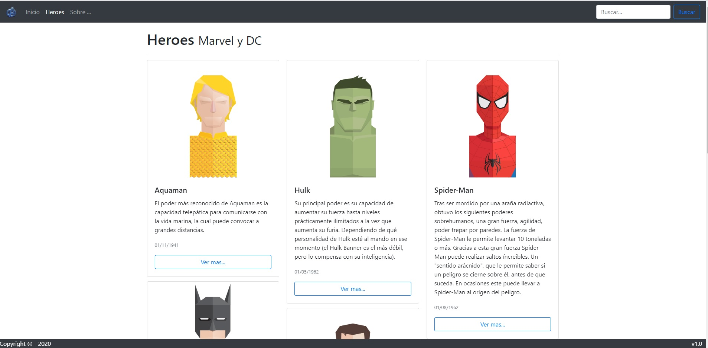

# spaHeroes
Ejemplo de SPA realizado en Angular y Bootstrap

> **UPDATE 08/01/2020:**: Repositorio actualizado. **(Buscador, Pipes, @Input/@Output (Componentes reutilizables))

Imagen Principal Artículo 

 

Proyecto generado con [Angular CLI](https://github.com/angular/angular-cli) version 8.3.20.

## Instalar Dependencias
1. Instalar `npm install`
2. Instalar `npm install bootstrap --save`
3. Instalar `npm install jquery --save`
4. Instalar `npm install popper.js --save`
5. Instalar `npm install --save-dev @fortawesome/fontawesome-free`

## Desarrollo
Ejecutar `ng serve` // `ng serve -o`. Poner en el navegador `http://localhost:4200/`.

## Construir para su distribucion en produccion
Ejecutar `ng build` para construir el proyecto. Esto genera en el directorio `dist/` todos los archivos necesarios para su distribucion.

## Test - Pruebas unitarias
Ejecutar `ng test` para proceder a testearlo via [Karma](https://karma-runner.github.io).

## Test - end-to-end
Ejecutar `ng e2e` para pruebas end-to-end via [Protractor](http://www.protractortest.org/).

## Ayuda
Para mas informacion sobre Angular CLI, ejecutar `ng help` o leer [Angular CLI README](https://github.com/angular/angular-cli/blob/master/README.md).
