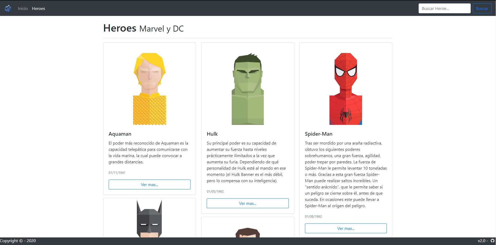

# spaHeroes
Ejemplo de Spa (Single Page Application) realizado en Angular y Bootstrap 4.

> **UPDATE 09/03/2020:**: Repositorio actualizado. **(Estructura de directorio Components)

Imagen Principal Artículo 

 

## Instalar Dependencias
- Instalar `npm install`
- Instalar `npm install bootstrap --save`
- Instalar `npm install jquery --save`
- Instalar `npm install popper.js --save`
- Instalar `npm install --save-dev @fortawesome/fontawesome-free`

## Iniciar proyecto
Ejecutar en terminal el comando `ng serve` e introducir en el navegador `http://localhost:4200/` o ejecutar `ng serve -o` y se abrira automaticamente en el navegador.

## Ayuda
Para mas informacion, ejecutar el comando `ng help` en el terminal o ir a [Angular CLI README](https://github.com/angular/angular-cli/blob/master/README.md).

Este proyecto se ha generado con [Angular CLI](https://github.com/angular/angular-cli) version 8.3.20.
